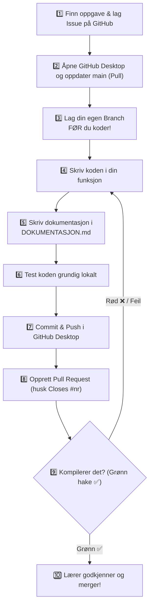

# 🎓 Elevguide: Fra idé til ferdig levert kode (Steg for steg)

Denne guiden tar deg trygt gjennom hele prosessen når du skal løse en oppgave i klokkeprosjektet. 
Følg stegene i rekkefølge, så unngår du feil, overskriving av andres arbeid eller trøbbel med Git!

> 🖥️ **Foretrekker du lysbilder?** Åpne [**`presentasjon.html`**](presentasjon.html) i nettleseren din for en interaktiv lysbildevisning med piltaster og fullskjerm!

---

## 🗺️ Oversikt over reisen



---

## 🎯 Steg 1: Velg oppgave og opprett et Issue

Før du rører koden, må du "reservere" oppgaven slik at ingen andre i klassen begynner på det samme.

1. Gå til repoet på **GitHub i nettleseren**.
2. Klikk på fanen **Issues** øverst.
3. Sjekk listen over åpne issues med merket `funksjon` – er oppgaven du vil ha ledig?
4. Trykk på den grønne knappen **New issue**.
5. Velg malen **"Velg en funksjon"** (trykk *Get started*).
6. Fyll ut:
   - Tittel: `[FUNKSJON] NavnPaFunksjon` (f.eks. `[FUNKSJON] fagFarge`)
   - Hvilken funksjon du skal lage
   - Hvem som jobber med den (ditt navn / gruppe)
7. Trykk **Submit new issue**.
8. **VIKTIG:** Merk deg nummeret på issuet ditt (f.eks. `#5`). Dette skal du bruke til slutt!

---

## 📥 Steg 2: Hent ferskeste kode fra GitHub

Kanskje en klassekamerat nettopp har fått sin funksjon godkjent? Du må alltid ha nyeste versjon før du starter.

1. Åpne **GitHub Desktop**.
2. Sjekk at **Current repository** er dette prosjektet.
3. Sjekk at **Current branch** står på `main`.
4. Trykk på **Fetch origin** (eller **Pull origin**) øverst til høyre.
5. Hvis det står *Pull origin*, trykk på den for å laste ned de nyeste endringene til din PC.

---

## 🌿 Steg 3: Lag din egen branch (FØR du koder!)

> [!CAUTION]
> **Skriv aldri kode direkte på `main`!**
> Hvis du begynner å redigere filer før du lager en branch, kan det bli rot når du skal levere. Lag alltid branchen **først**.

1. Øverst i GitHub Desktop, klikk på **Current branch** (`main`).
2. Klikk på knappen **New branch**.
3. Gi branchen et fornuftig navn, for eksempel:
   - `funksjon-fagFarge` eller `ole-fagFarge`
4. Sørg for at den lages basert på `main`.
5. Trykk **Create branch**.
6. Nå ser du at **Current branch** har byttet navn til din nye branch. Du er klar til å kode!

---

## 💻 Steg 4: Implementer funksjonen i koden

Nå kan du åpne koden i **Arduino IDE** eller **VS Code**.

1. Åpne `sketch/sketch.ino`.
2. Finn funksjonen din (bruk `Ctrl+F` for å søke etter funksjonsnavnet).
3. **Spilleregler:**
   - Endre **kun** inni din egen funksjon.
   - **Ikke** rør andres funksjoner, og ikke endre `setup()` eller `loop()` (bortsett fra midlertidig testing).
   - **Ikke** endre funksjonens navn, parametere eller returtype.
   - Skriv inn navnet ditt på kommentarlinjen: `// Laget av: DittNavn`.
4. Skriv ferdig koden for funksjonen din.
5. Lagre filen (`Ctrl+S`).

---

## 📝 Steg 5: Fyll ut dokumentasjonen

All forklaring og refleksjon skal ligge i **DOKUMENTASJON.md** (ikke i koden).

1. Åpne filen `DOKUMENTASJON.md`.
2. Scroll ned til du finner overskriften for din funksjon.
3. Fyll inn de 5 punktene under overskriften:
   - **Laget av:** Ditt navn
   - **Hva gjør den?** (1–3 setninger med egne ord)
   - **Parametere:** Forklar hva variablene som sendes inn betyr
   - **Returverdi:** Hva returnerer funksjonen?
   - **Refleksjon:** Hvorfor løste du det slik? Hva var utfordrende?
4. Lagre filen (`Ctrl+S`).

---

## 🧪 Steg 6: Test koden lokalt

Før du sender inn koden, må du være sikker på at den virker!

1. **Kompiler koden:**
   - I Arduino IDE: Trykk på **Verify**-knappen (fluebeinet / `Ctrl+R`).
   - I VS Code: Trykk `Ctrl+Shift+B` (Build).
   - Fiks eventuelle skrivefeil eller feilmeldinger helt til den kompilerer uten feil.
2. **Funksjonstest:**
   - **Metode A (Wokwi i VS Code):** Start simuleringen og se at LED-ringen / Serial oppfører seg riktig.
   - **Metode B (Fysisk ESP32):** Last opp til en ESP32 koblet til PC-en.
   - **Metode C (Testlinje i setup):** Legg inn en midlertidig linje nederst i `setup()`, f.eks. `Serial.println(fagNavn(MATTE));` for å sjekke resultatet.
3. > [!IMPORTANT]
   > Hvis du la inn en midlertidig testlinje i `setup()`, må du **huske å fjerne den** før du går videre til neste steg!

---

## 💾 Steg 7: Commit og Push til GitHub

Nå skal du lagre et "øyeblikksbilde" (commit) og laste det opp til GitHub (push).

1. Bytt tilbake til vinduet **GitHub Desktop**.
2. Til venstre under **Changes** skal du nå se to endrede filer:
   - `sketch/sketch.ino`
   - `DOKUMENTASJON.md`
   *(Hvis du ser andre filer du ikke har ment å endre, sjekk hva som har skjedd før du går videre!)*
3. Klikk på filene og se over endringene (grønt = nytt, rødt = fjernet).
4. Nederst til venstre: Skriv en kort, beskrivende **commit-melding**, f.eks.:
   - `Implementert fagFarge() og oppdatert dokumentasjon`
5. Trykk på den blå knappen **Commit to <din-branch>**.
6. Øverst på skjermen dukker det nå opp en knapp: **Publish branch** (eller **Push origin**). Trykk på den!
7. Nå er koden din trygt lastet opp til GitHub på din egen branch.

---

## 🚀 Steg 8: Opprett en Pull Request (PR)

Nå ber du læreren om å godkjenne og flette (merge) koden din inn i hovedprosjektet.

1. I GitHub Desktop: Trykk på den blå knappen **Create Pull Request** (dette åpner GitHub i nettleseren din).
2. Sjekk at toppen viser:
   - `base: main` $\leftarrow$ `compare: din-branch`
3. Tittelen fylles vanligvis automatisk ut med commit-meldingen din.
4. I det store tekstfeltet dukker prosjektets ferdige **Pull Request-mal** opp:
   - Svar på spørsmålene (hvilken funksjon, hvordan du testet).
   - Huk av på sjekklisten med `[x]`.
5. > [!IMPORTANT]
   > **SUPER-VIKTIG: Ikke glem linjen `Closes #<nummer>`!**
   > Helt nederst i PR-beskrivelsen står det `Closes #`. Skriv inn nummeret på issuet du lagde i Steg 1, f.eks.:
   > ```markdown
   > Closes #5
   > ```
   > *(Husk: **ingen mellomrom** mellom `#` og tallet).*
   > 
   > ✨ **Hvorfor er dette så genialt?** Da kobles PR-en direkte til oppgaven din, og **GitHub lukker issuet automatisk** i samme sekund som læreren godkjenner og merger koden! Du slipper å lukke det manuelt.
6. Trykk på den grønne knappen **Create pull request**.

---

## ⏳ Steg 9: Vent på CI-sjekk og tilbakemelding

1. **Automatisk sjekk:** Rett under beskrivelsen din på GitHub vil det etter 1–2 minutter dukke opp en automatisk test (*Build Sketch*).
   - ✅ **Grønn hake:** Koden kompilerer fint! Alt er klart for læreren.
   - ❌ **Rødt kryss:** Noe i koden gjør at den ikke bygger. Klikk på *Details* for å se feilen, fiks den i kildekoden lokalt, og gjør en ny Commit + Push i GitHub Desktop. Da oppdaterer PR-en seg automatisk!
2. **Lærerens gjennomgang:**
   - Læreren tester koden din.
   - Hvis læreren ber om endringer: Du gjør endringene på din PC, lagrer, og committer + pusher på nytt på samme branch.
   - Hvis alt er supert: Læreren godkjenner og trykker **Merge**. Gratulerer, koden din er nå en del av fellesprosjektet! 🎉

---

## 🧹 Steg 10: Rydd opp til neste oppgave

Når PR-en er merget:

1. Åpne **GitHub Desktop**.
2. Bytt **Current branch** tilbake til `main`.
3. Trykk på **Fetch origin** og deretter **Pull origin**.
4. Nå har du hele den oppdaterte felleskoden på din PC, inkludert din egen nye funksjon!
5. Klar for en ny oppgave? Start på nytt fra **Steg 1**! 🚀
